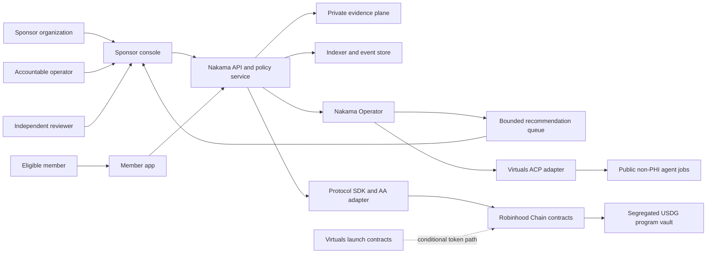
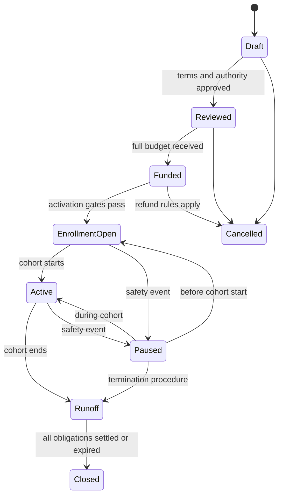

# Technical Architecture

## Architecture Decision

Build a Robinhood Chain-native vertical slice around one sponsor-funded
protection program. Keep the contracts EVM-portable, isolate Virtuals and
Robinhood integrations behind adapters, and separate public economic state
from private health and identity data.

The architecture must prove one complete loop before becoming a general pool
factory: configure terms, fund the full program budget, enroll eligible
members, receive a request, review private evidence, create an obligation,
settle USDG, and produce an auditable report.

Existing protocol code is a source of tested primitives, not the target design.
Nothing is reused merely because it already exists. A component moves into the
new path only after its state model, authority, accounting, and failure
behavior satisfy the invariants in this document.

## System Context



The arrows do not imply equal trust. The private plane is the source of raw
evidence, the API is the source of workflow state, and Robinhood Chain is the
source of economic state and signed authority. A hash onchain proves that a
specific artifact existed; it does not prove the artifact is true, medically
valid, or lawfully processed.

## Non-Negotiable Invariants

1. **Program money is segregated.** Sponsor-funded USDG for member obligations
   cannot be spent on Nakama payroll, gas, agent jobs, token liquidity, or ACP
   escrow.
2. **The token is outside the protection ledger.** `$NAKAMA` is never accepted
   as program funding, member contribution, collateral for a member benefit,
   or claim payout.
3. **A promise cannot exceed its funding.** Before activation, the maximum
   remaining program liability must be covered by actual available assets.
4. **Private evidence stays private.** No raw diagnosis, medical document,
   identity document, support transcript, or dispute narrative is emitted in
   calldata, logs, token metadata, IPFS, or public agent output.
5. **Agents cannot finalize harm.** In Phase 0, agents can structure, check,
   recommend, and prepare. An authorized accountable person signs approvals,
   denials, appeals, material configuration changes, and payouts.
6. **No-quorum is not denial.** A missing reviewer or unavailable service
   escalates the request and preserves the associated budget; it cannot silently
   extinguish a member right.
7. **Every authority is bounded.** Roles, selectors, amounts, time windows,
   nonces, and program identifiers are explicit. No ambient agent or relayer
   authority is accepted.
8. **Programs pin their code and terms.** An active program is not silently
   migrated when Nakama deploys a new implementation or changes a template.
9. **External dependencies can fail closed.** Virtuals, ACP, public RPC, bridge,
   indexer, wallet, and agent outages cannot move program funds or change a
   member determination.
10. **Public claims follow deployed truth.** UI and marketing state are derived
    from verified manifests, not roadmap intent.

## Trust Planes

| Plane | Contains | Primary trust | Must never contain |
| --- | --- | --- | --- |
| Public protocol | Program identifiers, terms commitments, role assignments, aggregate budget state, obligations, settlement receipts | Contract code, signers, Robinhood Chain finality | Raw medical evidence, full identity, private communications |
| Private evidence | Evidence files, identity mapping, reviewer notes, dispute details, consent and access records | Encryption, KMS, access policy, audited operators | Token balances as a care-priority signal |
| Product workflow | Intake state, deadlines, tasks, notifications, review queues | Nakama services and append-only audit trail | Unsigned final economic authority |
| Agent | Structured inputs, approved templates, minimum necessary evidence fields, public program state | Model policy, tool allowlist, evaluation, human approval | Reserve keys, unrestricted member records, final denial authority |
| ACP | Public job specifications, non-sensitive inputs, delivery commitments, escrow state | Virtuals ACP contracts and adapter | PHI, member identity, program reserve approval |
| Token and community | Token balances, public proposals, grants, registry votes | Virtuals launch contracts and Nakama governance | Individual benefit decisions or evidence access |

## Contract Suite

Each deployed program pins an immutable suite version. A new implementation is
introduced through a new factory version; existing programs keep their code
unless their signed terms contain an explicit migration path.

| Contract | Responsibility | Phase 0 authority |
| --- | --- | --- |
| `NakamaFactory` | Deploy a deterministic program suite from an approved template and version | Deployment multisig after legal, security, and sponsor gates |
| `PoolRegistry` | Index programs, versions, status, sponsor, and canonical metadata commitment | Factory writes; safety council can mark a public warning without rewriting history |
| `TemplateRegistry` | Register reviewed term schemas and code-compatible policy templates | Template council multisig; active programs pin a version |
| `ProtectionProgram` | Hold the program state machine, cohort dates, terms commitment, caps, and role references | Sponsor and operator according to explicit transition matrix |
| `PoolVault` | Custody approved USDG and enforce encumbrance, obligation, refund, and withdrawal rules | Program state machine plus settlement role; no arbitrary operator transfer |
| `MembershipRegistry` | Record pseudonymous membership commitments, eligibility state, activation, and cancellation | Approved eligibility attestor; member controls its account |
| `ClaimManager` | Record request commitment, deadlines, determination state, appeal state, and obligation link | Member, reviewer, appeal reviewer, and settlement module by transition |
| `DecisionModule` | Verify typed approvals, denials, requests for information, and appeal decisions | Role registry, EIP-712 signatures, nonce and deadline |
| `SettlementModule` | Convert final approved determinations into exact USDG obligations and settlement receipts | No discretion beyond signed amount, recipient commitment, and cap |
| `AgentAuthorizationRegistry` | Store expiring, selector-level agent permissions and spend caps | Program governance; cannot grant reserve or final-decision authority |
| `SafetyGuardian` | Pause new joins, new obligations, or settlement under predefined incidents | Threshold multisig with reason code, public event, and expiry |

`Pool` remains a technical name where useful, but public product interfaces use
`Program` until legal structure permits stronger language.

## Program State Machine



Every transition emits the program identifier, previous state, next state,
actor, reason code, terms version, and timestamp. `Active` is unreachable unless
the vault satisfies its funding invariant, all critical roles are assigned,
the private evidence service is healthy, and the signed activation checklist
matches the onchain configuration.

## Conservative Budget Accounting

Phase 0 uses a fixed sponsor budget instead of member contributions or
actuarially priced pooled risk.

```text
assets = actual approved USDG balance held by the program vault

encumbered =
    maximum_remaining_liability_for_active_members
  + approved_but_unpaid_obligations
  + matured_refunds_or_exit_obligations

free_liquidity = assets - encumbered

required invariant: free_liquidity >= 0
```

The maximum remaining liability calculation must be deterministic from the
active member set, per-member cap, aggregate cap, already consumed benefit,
pending-request reservation policy, and cancellation rules. It cannot rely on
an offchain dashboard balance.

Funding, encumbrance, obligation, settlement, refund, and permitted sponsor
recovery are separate ledger movements. Direct ERC-20 transfers into the vault
increase assets but do not activate a program or change its liability limit.
Fee-on-transfer, rebasing, callback-bearing, and unapproved assets are rejected.

## Member and Eligibility Model

The onchain member identifier is a salted commitment derived through an
approved identity service. It must not be a raw email, passport number, patient
identifier, or reversible hash of a small input space.

Membership records include only:

- program identifier
- pseudonymous member commitment
- eligibility attestation identifier and issuer
- activation and expiry timestamps
- terms version acknowledged
- benefit consumed and remaining, if public disclosure is legally acceptable
- cancellation state and reason class

The private identity mapping is held separately with explicit retention and
deletion rules. A wallet is an authorization endpoint, not the member's public
health identity. Account recovery must preserve program rights without
publishing the old-to-new identity mapping.

## Request, Decision, and Settlement Lifecycle

```text
committed
  -> evidence_ready
  -> review_pending
  -> approved | denied | needs_information
  -> appeal_pending, when challenged
  -> final_approved | final_denied
  -> obligation_created, if approved
  -> settled
```

The public claim/request record contains a random identifier, member
commitment, program identifier, evidence-manifest commitment, submitted time,
status, deadline, decision commitment, reason-code class, appeal state,
obligation amount, and settlement receipt. It excludes diagnoses, provider
names, free text, document URLs, and detailed denial explanations.

An approval or denial uses EIP-712 typed data containing at minimum:

- domain, chain ID, verifying contract, and program ID
- request ID and evidence-manifest commitment
- decision type and public-safe reason code
- exact approved amount and recipient commitment when applicable
- terms version and reviewer role
- nonce, issued time, expiry, and appeal eligibility

Smart-account signers must support EIP-1271. A signature for one program,
amount, or evidence manifest cannot be replayed for another. The private signed
decision artifact contains the complete rationale and is retained under the
evidence policy.

## Account Abstraction and Wallet Experience

Account abstraction should remove unnecessary crypto friction without hiding
the transaction's economic meaning.

The member flow may batch:

1. create or connect a smart account
2. acknowledge the exact terms commitment
3. authorize the minimum program action
4. activate membership

The sponsor flow may batch an exact USDG approval and funding transaction. The
paymaster sponsors only allowlisted selectors, programs, values, frequency,
and account states. It never sponsors arbitrary calls or token transfers.
Session keys expire quickly and are scoped to non-economic workflow actions.

Every interface shows the asset name, symbol, address, decimals, amount,
program, action, and consequence before signature. ACP's current USDG-as-USDC
label is overridden at Nakama's adapter boundary and cannot reach user copy or
signed records.

## Private Evidence Plane

The evidence service is its own security boundary, not a file-upload feature
inside a general API.

Required controls:

- one data-encryption key per request or evidence package
- envelope encryption with KMS-managed wrapping keys
- separate object-store namespace and service identity
- short-lived signed upload and download URLs
- malware scanning and file-type validation before reviewer access
- purpose-based RBAC and least-privilege reviewer assignments
- append-only access records with actor, purpose, object, and timestamp
- consent version, collection purpose, residency, retention, and deletion state
- field-level redaction before model or third-party processor access
- no PHI in logs, traces, analytics, error payloads, prompts, or ACP jobs
- tested export, correction, revocation, legal hold, and deletion procedures

The evidence manifest lists content hashes, encrypted object references,
collector, timestamps, and consent context. Only its commitment is anchored
onchain. Changing any item creates a new manifest version and invalidates a
decision signature tied to the prior commitment.

## Nakama Operator Architecture

The agent is a policy-controlled workflow worker with explicit tools:

- template-constrained program design and scenario modelling
- public-chain and indexed-state queries
- evidence-completeness checks over redacted structured fields
- reviewer task creation and deadline monitoring
- member and sponsor communications from approved templates
- public-safe operating reports
- ACP buying and selling through a separate capped wallet

Each tool declares input schema, output schema, permitted data class, side
effects, maximum economic value, approval requirement, and audit fields. The
agent cannot call raw RPC write methods, read unrestricted evidence storage,
change its own policy, or approve a final benefit.

Model output is never the system of record. A deterministic policy layer checks
schema, terms version, source data, allowed amounts, and authority before a
recommendation enters a human queue. Every accepted or rejected recommendation
is retained for evaluation without exposing member data publicly.

## Virtuals and ACP Adapter

Virtuals is an external distribution and commerce dependency. It does not sit
inside the program-vault authority path.

The adapter must:

- pin a reviewed `@virtuals-protocol/acp-node-v2` version
- translate Robinhood chain IDs and explicit USDG metadata
- reject unsupported assets and symbol/address mismatches
- maintain a distinct ACP smart account and allowance budget
- persist job, negotiation, escrow, delivery, evaluation, and settlement state
- reconcile contract events independently of the package's local state
- expose a kill switch that leaves the protection product operational
- redact and classify every payload before it reaches ACP
- tolerate fee, contract, and configuration changes without silent repricing

Only bounded, non-PHI services are offered initially: program-design
simulations, public reserve-health reports, public terms translation, operating
audits, and protocol-risk reviews.

## Indexing, Finality, and Reconciliation

The product cannot depend on one public RPC or assume a submitted transaction
is final.

- Use two independently operated RPC providers plus a documented emergency
  fallback.
- Record submission hash, inclusion block, confirmation depth, and finalized
  status separately.
- Build an idempotent indexer from contract events and periodic state reads.
- Reconcile vault token balances against internal ledgers and obligations.
- Detect reorgs, missed events, proxy implementation changes, and chain stalls.
- Block irreversible offchain actions until the required confirmation policy
  passes.
- Retain signed deployment manifests with bytecode, compiler, source commit,
  constructor arguments, role addresses, and explorer verification links.

Canonical bridge withdrawals may take roughly seven days, so an active program
must be prefunded on Robinhood Chain. Bridging expected claim money after a
request arrives is not an acceptable liquidity plan.

## Deployment and Upgrade Model

The core suite should be immutable per program. Registries may add new template
and suite versions, but cannot rewrite a funded program's code or terms.

External upgradeable dependencies—including Virtuals launch and ACP
contracts—are monitored by address, implementation, admin, bytecode, and
configuration. A dependency change triggers an adapter pause and review; it
never automatically upgrades Nakama's economic behavior.

Emergency controls are narrow:

- pause new membership
- pause creation of new obligations
- pause settlement when continued settlement could worsen loss
- revoke an agent session or ACP allowance
- warn against a compromised suite version

Emergency authority cannot confiscate a member's settled funds, alter signed
terms, invent a new recipient, or withdraw unencumbered sponsor funds outside
the agreed termination path.

## Repository Ownership

| Repository | Owns | Does not own |
| --- | --- | --- |
| `nakama-protocol` | Contracts, invariants, deployment tooling, manifests, simulations, formal properties, security and release evidence | Product workflow, private evidence, marketing copy |
| `nakama-sdk` | Canonical typed API, generated ABIs, action builders, EIP-712 types, AA adapter, receipts, finality, query interfaces | Independent hand-edited contract definitions |
| `nakama-health` | API gateway, identity, private evidence, claims workflow, sponsor console, member app, indexer, agent runtime, ACP adapter | Contract truth duplicated in application databases |
| `nakamahealth-website` | Category narrative, buyer conversion, public program transparency, launch and risk disclosures | Private member workflow or unverified roadmap claims |

The generation flow is one-way:

```text
protocol source and deployment manifest
  -> generated ABI and typed SDK
  -> shared action and event schemas
  -> backend, apps, operator console, and agent tools
  -> public website read models
```

No downstream repository hand-edits an ABI or contract address. Address
manifests are environment-specific, signed or checksummed, and validated on
startup against chain ID and bytecode.

## Reuse Policy

Existing components can be reused only after a written invariant review.

| Existing concept | Likely treatment |
| --- | --- |
| Reserve vault accounting | Reuse ideas and tests; replace any global or yield-coupled assumptions |
| Policy and membership registries | Reuse typed-data, nonce, and indexing patterns if privacy model passes |
| Factory deployment | Reuse deterministic deployment patterns; deploy new immutable suite versions |
| Claim lifecycle | Reuse state-machine concepts; add evidence commitment, appeal separation, no-quorum escalation, and obligation reservation |
| Oracle abstractions | Keep outside Phase 0 final decisions; use only for bounded public facts after validation |
| Prior chain-specific SDKs | Do not preserve compatibility at the cost of the Robinhood-native model |
| Existing frontend terminology | Replace claims of insurance, mutual status, or token necessity unless verified for Phase 0 |

## Environments

1. **Local deterministic environment:** contracts, mock USDG, smart accounts,
   agent policies, evidence stubs, and full lifecycle tests.
2. **Robinhood testnet:** real chain ID, RPC/finality behavior, wallet and AA,
   mock-value program, ACP sandbox where supported, and explorer verification.
3. **Mainnet shadow:** deployed but unfunded contracts, read-only indexer,
   dependency monitoring, and production operations rehearsal.
4. **Funded mainnet pilot:** one sponsor, one cohort, exact budget, limited
   benefits, named humans, continuous reconciliation, and incident coverage.
5. **Repeatable production:** allowed only after the first program closes with
   complete financial, service, privacy, and security evidence.

## Observability and Operating Evidence

The minimum production dashboard shows:

- chain head, finality lag, RPC health, and indexer divergence
- program lifecycle and activation-gate state
- actual assets, encumbered amount, free liquidity, obligations, and refunds
- member activation and request SLA state without PHI
- agent recommendation volume, human override, error, and latency
- ACP jobs, delivery, disputed jobs, fees, and reconciliation differences
- paymaster spend, blocked calls, and session-key expiry
- privileged-role changes, pauses, dependency upgrades, and stablecoin events

Each alert has an owner, severity, response deadline, runbook, and evidence
retention requirement. A dashboard without an on-call decision is decoration.

## Technical Release Gates

The first funded program is blocked until all of these are true:

- contract specifications and threat model are approved
- accounting invariants pass unit, invariant, fuzz, integration, and fork tests
- an independent review covers contracts and privileged operations
- every deployment address and bytecode is verified in a signed manifest
- full lifecycle succeeds twice on Robinhood testnet, including appeal, pause,
  refund, and RPC/indexer failure paths
- private evidence controls pass access, deletion, redaction, and incident tests
- agent evaluation demonstrates no unauthorized tool or data access
- AA policies reject arbitrary calls and enforce economic caps
- USDG identity, liquidity, custody, redemption, and incident procedures pass
- mainnet roles are threshold-controlled, rehearsed, and monitored
- legal and sponsor activation gates in the safety plan pass

Passing these gates makes a bounded pilot operable. It does not prove PMF,
regulatory approval, or the necessity of a token.
