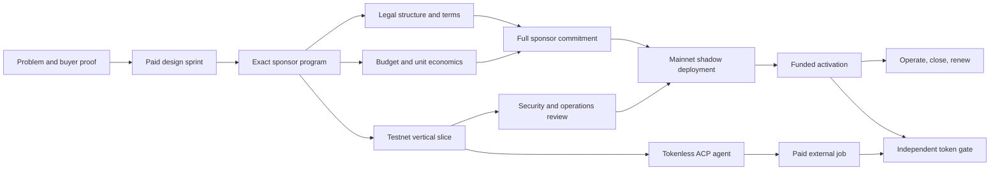

# Master Roadmap

## Outcome

Deliver one safe, paid, sponsor-funded Genesis Protection Program on Robinhood
Chain and one productive Nakama Operator with bounded ACP services. Prepare but
do not presume a Virtuals token launch.

The roadmap is organized around evidence gates rather than feature completion.
Commercial, legal, product, and technical work run concurrently, but funded
mainnet activation waits for all four.

## Critical Path

The critical commercial milestone is the complete sponsor budget, not a letter
of intent. The critical engineering milestone is the end-to-end adverse-path
test, not contract deployment. The critical token milestone is a signed
go/no-go packet, not a target date.

## Phase 0 — Mobilize and Freeze the Decision Frame

Target window: days 0–3

### Outcomes

- one named product owner and one accountable founder decision-maker
- one canonical glossary: program, sponsor budget, member, request,
  determination, obligation, settlement, agent, and token
- explicit Phase 0 exclusions and kill criteria accepted by team
- cross-repository owners and dependency flow recorded
- current platform evidence snapshot reviewed
- no public language that implies a live sponsor, legal mutual, insurance,
  Robinhood distribution, Virtuals approval, or token guarantee

### Deliverables

- decision register entries D-001 through D-012
- work-item board generated from the 90-day backlog
- repository branch/lock and release ownership check
- sponsor interview and data-capture schema
- legal product-description packet
- architecture ADR skeleton and contract invariant specification
- environment and secret-management inventory without secret values

### Exit gate

The team can answer which buyer, product, funding source, chain role, agent
role, token role, and legal questions are being tested. Any team member can
state what is deliberately excluded.

## Phase 1 — Prove the Buyer While Building the Skeleton

Target window: days 4–30

### Commercial stream

- research 40 named ICP accounts
- complete 30 qualified interviews
- quantify incidents, current alternative, spend, authority, deadline, cohort,
  and costly next action
- send ten priced Protection Design Sprint proposals
- close at least two paid design partners
- choose one sponsor candidate using urgency, authority, data, funding,
  legal feasibility, and case-study willingness

### Product and legal stream

- run sponsor and member prototype sessions
- define one standard benefit schedule, cap model, exclusions, evidence schema,
  review SLA, appeal, termination, and unused-budget rule
- obtain preliminary entity/jurisdiction classification for the chosen sponsor
  context
- identify required regulated or service partners
- map privacy roles, processors, data classes, retention, and consent
- obtain preliminary USDG/custody/liquidity assessment

### Engineering stream

- approve architecture and core invariants
- implement local contract skeleton and deterministic program lifecycle
- generate SDK types and a mock sponsor/member flow
- stand up isolated synthetic evidence service
- implement Robinhood testnet network, RPC, indexer, and finality adapter
- prototype passkey/smart-account onboarding and sponsored gas
- implement Nakama Operator tool policy and one proposal-generation task
- wrap ACP v2 behind a disabled-by-default adapter with explicit USDG metadata

### Exit gate

At least two independent buyers have paid for design work, one real sponsor
context informs the product, and the local/testnet skeleton demonstrates the
complete happy path with synthetic data. If the paid-design threshold fails,
custom engineering pauses and the team revisits ICP, problem, and offer.

## Phase 2 — Earn a Fully Funded Pilot

Target window: days 31–60

### Commercial and legal stream

- complete the selected sponsor design sprint
- agree exact cohort, dates, eligibility, benefit schedule, aggregate budget,
  fees, member communications, operations, refund, and termination
- obtain written legal structure and jurisdiction matrix
- execute sponsor agreement and collect Nakama implementation payment
- secure the complete sponsor program budget subject to final activation gates
- contract reviewers, appeal capacity, and any required licensed/service partner

### Product and operations stream

- ship sponsor console and member onboarding beta
- validate comprehension with representative members
- exercise standard, missing-evidence, urgent, denial, appeal, refund, and
  emergency support scenarios
- finalize runbooks, staffing, escalation, and communications
- measure setup labor and update unit economics with actual cost

### Engineering stream

- complete contract suite, accounting invariants, and role controls
- complete SDK generation, EIP-712, AA, receipt, finality, and error model
- complete private evidence encryption, access, audit, retention, and deletion
- complete deterministic review workflow and agent recommendation queue
- complete USDG funding/settlement and reconciliation on testnet
- complete ACP public job listing in a safe environment and one external
  production-quality delivery rehearsal
- run internal security, privacy, chaos, and incident exercises

### Exit gate

The sponsor has signed and committed the full pilot economics, counsel has
approved the actual structure, all member-facing terms are stable, and the
testnet vertical slice passes normal and adverse cases. A partial sponsor
deposit or unresolved legal category does not pass.

## Phase 3 — Release, Activate, or Stop

Target window: days 61–90

### Independent review

- independent contract and privileged-role review
- privacy and evidence control review
- legal/terms/public-copy final review
- USDG, custody, bridge, liquidity, and depeg review
- operations tabletop and signer recovery exercise
- deployment manifest, monitoring, alert, and rollback review

### Shadow mainnet

- deploy immutable suite and registries with no member promise and no program
  funding
- verify source, bytecode, addresses, roles, AA, RPC, indexer, alerts, and
  dependency monitors
- run synthetic zero/low-value lifecycle
- compare all public copy with deployed capabilities

### Funded activation

- execute the signed sponsor funding transaction
- verify actual USDG, maximum liability, encumbrance, and free liquidity
- sign activation checklist through threshold roles
- open enrollment to the exact eligible cohort
- monitor member comprehension and activation
- operate daily financial, service, privacy, agent, and chain controls

### Token decision

In parallel, assemble the token packet only if:

- the product path has a paid sponsor and funded program
- a tokenless agent has delivered at least one paid external job
- a production action genuinely needs `$NAKAMA`
- Virtuals health-use-case and Malaysia eligibility are resolved in writing
- exact live launch mechanics are decoded and independently reviewed
- treasury, custody, disclosures, market conduct, tax, and twelve-month
  operations are resourced

The token decision can be `launch`, `defer`, `change route`, or `do not launch`.
No marketing calendar overrides the gate.

### Exit gate

Either the funded program is operating under verified controls, or the team has
issued a signed no-launch/pivot decision tied to a failed criterion. A shadow
deployment is not silently promoted to production.

## Workstreams and Accountable Outputs

| Workstream | Accountable owner | Day-30 output | Day-60 output | Day-90 output |
| --- | --- | --- | --- | --- |
| PMF and revenue | Founder/revenue lead | 30 interviews, ten proposals, two paid designs | Funded sponsor agreement | Activation, renewal plan, or segment decision |
| Product and clinical | Product/clinical lead | Standard program prototype | Signed schedule, evidence, workflow, SLA | Member activation and live operating controls |
| Legal and privacy | Legal/privacy lead | Preliminary structure/data map | Written actual-sponsor approvals | Release sign-off and incident readiness |
| Protocol | Protocol lead | Local lifecycle and invariants | Testnet adverse-path suite | Verified mainnet manifest and reconciliation |
| SDK and AA | SDK lead | Generated prototype and account flow | Stable typed integration | Production receipts, finality, failover |
| Product services | Backend/product lead | Synthetic evidence and workflow | Sponsor/member beta | Production operations and reporting |
| Agent and ACP | Agent lead | Bounded proposal agent | Evaluated workflow and safe ACP offering | Paid external job or explicit no-marketplace result |
| Website/content | Growth/communications lead | Evidence-safe buyer story | Sponsor/launch materials | Deployed-truth pages and case-study plan |
| Security/operations | Security/operations lead | Threat model and runbook outline | Exercises and review packet | Independent gate and on-call operation |
| Token/treasury | Founder/finance/governance | Token necessity hypothesis | Draft no-launch/launch packet | Independent decision, never assumed launch |

One person may hold multiple roles in the first 90 days, but each output still
needs an explicit second reviewer where conflict or safety requires it.

## Dependency Rules

- The contract terms schema depends on the approved product schedule, but local
  architecture can proceed against a versioned example.
- The SDK consumes generated protocol artifacts; hand-edited duplicate ABIs
  cannot release.
- The backend may mock chain receipts during design, but production state
  reconciles to verified contracts.
- The member app cannot finalize copy before legal terms and wallet behavior are
  stable.
- The website can explain the vision, but live status and metrics must come from
  verified manifests and evidence packets.
- ACP work cannot receive restricted data or access program-vault authority.
- Token work cannot delay the product critical path or use the program budget.

## Resource and Budget Categories

Before committing a launch date, the operating model must fund:

- product and protocol engineering
- independent contract/security review
- legal opinions and contract drafting in actual jurisdictions
- privacy/data-protection assessment and processor contracts
- reviewer, appeal, clinical/operations, and member-support coverage
- USDG custody, liquidity, bridging, gas, AA, RPC, indexing, monitoring, and
  incident capacity
- sponsor/member research and usability testing
- token legal, treasury, custody, disclosures, market conduct, and community
  operations if the token gate passes
- contingency for program obligations separate from Nakama operating runway

No budget should assume creator fees, ACF, token appreciation, or unused sponsor
funds. Those are possible inflows or restricted balances, not reliable runway.

## Scope Vetoes for the First Ninety Days

- member-funded pooling
- yield on program assets
- multiple benefit categories or open geographies
- permissionless program creation
- token-holder claim decisions
- autonomous denials or payouts
- public PHI or reusable medical profiles
- cross-chain active program state
- bespoke RWA reserve assets
- DAO control of active sponsor terms
- large founder token purchase
- a public launch date before eligibility and live mechanics are known

## Roadmap Change Control

A roadmap change states:

1. new evidence or failed assumption
2. affected decision and work items
3. product, safety, economic, legal, and communications consequences
4. work stopped or deferred to make room
5. owner and reviewer
6. whether sponsor/member consent or terms versioning is required

Scope does not expand because an ecosystem narrative becomes popular. It
expands because a gate passes or because customer evidence makes the current
plan wrong.
