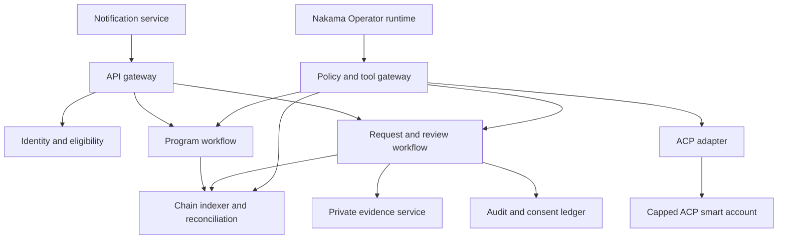

# Agent, Data, and Services Implementation

## Outcome

Build the private and operational plane that turns the contract suite into a
usable product: sponsor configuration, eligibility, identity mapping, private
evidence, request workflow, accountable review, notifications, financial
reconciliation, the Nakama Operator, and a safe Virtuals ACP adapter.

The services coordinate work; they do not invent onchain economic truth. Raw
health evidence remains private, while final authority and settlement remain
signed and reconcilable.

## Service Boundaries

Services may begin in one deployable application for speed, but authorization,
data stores, encryption keys, logs, and outbound network policies preserve
these boundaries. The evidence service and agent tool gateway are separate
security domains from the general product API.

## Canonical Data Rules

- Onchain contracts own program state, economic balances, signed role state,
  obligations, and settlement receipts.
- The workflow service owns tasks, deadlines, private status detail, member
  communication, and human-review queues.
- The evidence service owns encrypted objects and manifests.
- The identity service owns the mapping between real person, sponsor roster,
  member commitment, and authorized accounts.
- The audit ledger owns immutable records of access, consent, tool use,
  decisions, overrides, and outbound disclosures.
- The CRM owns prospect and commercial stage, not protected-member data.
- Analytics receives approved aggregate events, never unrestricted operational
  databases.

Every replicated onchain field stores block number, transaction hash,
confirmation/finality state, event index, indexer version, and reconciliation
status. Application writes cannot mark an economic action final.

## Work Items

### H-001 — Service architecture and data-flow model

**Outcome:** A reviewed design defines services, trust boundaries, data classes,
stores, identities, processors, network paths, and failure behavior.

**Acceptance:**

- every data field is classified and assigned a source of truth
- every service account has minimum database, object, KMS, RPC, and network
  access
- health/identity data cannot flow to analytics, general logs, ACP, or public
  model providers by default
- all third-party processors and data regions are enumerated
- manual continuity exists for agent, chain, notification, and review-service
  outages
- legal, privacy, security, product, and protocol reviewers sign the data flow

### H-002 — Sponsor organization and program workspace

**Outcome:** A named sponsor can configure and operate one program through a
controlled workspace tied to its legal and onchain identity.

**Scope:** Organization, users, roles, cohort roster import, program draft,
terms versions, approval checklist, budget instructions, launch state, member
communications, aggregate operations, and closure report.

**Acceptance:**

- organization membership and privileges are explicit and auditable
- sponsor user cannot see evidence or detailed reviewer notes without a
  separately approved purpose and role
- cohort import validates schema, consent/source, duplicates, expiry, and
  minimum data
- every terms/config change creates a reviewable version
- UI state distinguishes draft, signed, onchain submitted, confirmed, funded,
  and active
- sponsor recovery instructions cannot bypass contract terms

### H-003 — Identity, eligibility, and account recovery

**Outcome:** Real members are mapped to pseudonymous onchain commitments and can
recover access without public identity linkage.

**Scope:** Sponsor roster, eligibility attestation, account/passkey binding,
salted commitment, duplicate detection, expiry, recovery, revocation, and
authorized representative.

**Acceptance:**

- commitments use high-entropy server/member context and cannot be reversed
  from common identifiers
- sponsor roster and wallet mapping are encrypted separately
- duplicate and ineligible attempts enter a safe human review path
- recovery needs strong identity checks and records old/new authorization
  privately
- recovery cannot replay membership or duplicate benefit capacity
- export/deletion behavior respects legal retention and active obligations

### H-004 — Isolated private evidence service

**Outcome:** Members can upload and reviewers can access minimum necessary
evidence with envelope encryption and complete access history.

**Scope:** Signed upload, malware/file validation, per-request key, KMS wrap,
object storage, manifest versioning, redaction, reviewer access, retention,
export, and deletion.

**Acceptance:**

- every request/evidence package uses a distinct data-encryption key
- general API and agent cannot list or download all evidence
- download links are short-lived, one-purpose, and actor-bound where possible
- file contents and metadata are scanned before reviewer availability
- manifest content hashes and consent context are deterministic
- every access records person/service, purpose, object, decision/request, and
  time in an append-only ledger
- restricted fields are absent from logs, traces, errors, backups outside
  policy, analytics, and ACP
- access, correction, export, legal hold, and deletion tests pass

### H-005 — Request and review workflow

**Outcome:** A member request moves through complete, timed, accountable review
with human fallback and exact onchain commitments.

**Scope:** Intake, triage, evidence checklist, urgent routing, information
request, primary review, decision signing, appeal, obligation, settlement,
member explanation, and closure.

**Acceptance:**

- every workflow state maps to the protocol lifecycle or an explicitly private
  substate
- urgent indicators notify a named human and show emergency-care guidance;
  agent confidence cannot suppress escalation
- clock start, pause, restart, breach, and escalation rules are deterministic
- denial includes a private terms-linked explanation and appeal route
- appeal reviewer is distinct and conflict-checked
- signed decision binds the current evidence manifest and exact onchain action
- duplicate message, retry, worker crash, and out-of-order chain event remain
  idempotent
- no-quorum preserves budget and escalates rather than auto-denying

### H-006 — Chain indexer, finality, and financial reconciliation

**Outcome:** Product state remains consistent with Robinhood Chain and detects
divergence before it affects a member promise.

**Scope:** Dual RPC, event ingestion, finality stages, reorg handling, state
reads, idempotent projections, vault/ledger reconciliation, dependency
monitoring, and replay.

**Acceptance:**

- indexer rebuild from genesis/deployment block produces the same projection
- duplicate, missing, reordered, and reverted events are handled
- daily reconciliation proves token balance, encumbrance, obligation,
  settlement, refund, and free-liquidity equality
- mismatch blocks affected economic actions and alerts an owner
- RPC failover and disagreement are tested
- external proxy implementation/admin/pause/config changes alert and can
  disable the dependent adapter
- product labels submitted, soft-confirmed, finalized, failed, and reorged
  states accurately

### H-007 — Notification and service-level engine

**Outcome:** Members, sponsors, reviewers, and responders receive accurate,
privacy-safe communications tied to actual deadlines and state.

**Scope:** Template versions, preference/consent, channel routing, urgent
escalation, delivery tracking, retries, quiet hours, language, and fallback.

**Acceptance:**

- no notification reveals sensitive health detail on an insecure lock screen,
  email subject, or message preview
- every template is linked to current terms and legal approval
- delivery failure enters an owned queue, not silent retry forever
- urgent and deadline breach alerts reach an accountable human through a tested
  secondary route
- chain-submitted and finalized language is not conflated
- unsubscribe does not suppress legally or operationally required notices

### H-008 — Append-only audit, consent, and evidence ledger

**Outcome:** Nakama can reconstruct who accessed, changed, recommended, signed,
communicated, and disclosed what, without depending on mutable application logs.

**Scope:** Actor identity, role, purpose, object, action, before/after
commitment, source, time, policy/template/model version, approval, outcome, and
retention.

**Acceptance:**

- application administrators cannot silently edit or delete audit history
- audit records avoid raw restricted payloads while retaining useful evidence
- model prompt/input references use redacted artifact IDs and policy version
- member consent and processor version are queryable for any evidence access
- exports support incident, complaint, appeal, legal, and independent-review
  use cases
- clock, identity, and service-integrity assumptions are monitored

### H-009 — Nakama Operator runtime and tool-policy gateway

**Outcome:** A productive agent performs bounded work under deterministic policy
and produces reviewable artifacts rather than free-form operational authority.

**Initial tools:**

- `draft_program_proposal`
- `simulate_budget_and_caps`
- `compare_terms_to_template`
- `check_evidence_completeness`
- `create_reviewer_task`
- `monitor_public_program_state`
- `draft_member_or_sponsor_message`
- `prepare_public_safe_report`
- `quote_or_deliver_acp_job`

**Acceptance:**

- each tool has JSON schema, data-class limit, side-effect class, role, program,
  value cap, timeout, and approval rule
- tool gateway rejects unrecognized tool, field, program, contract, selector,
  value, or data class
- model cannot issue raw database, object-store, RPC write, shell, or wallet
  calls
- prompt injection from documents, websites, chain metadata, or ACP is treated
  as untrusted data
- all recommendations cite terms/data sources and identify uncertainty
- final adverse decisions and payouts always require authorized human signature
- agent outage degrades to a documented manual workflow
- evaluation captures correctness, unsupported claims, leakage, overrides,
  latency, staff time, and harmful errors

### H-010 — Agent evaluation and autonomy ladder

**Outcome:** Agent authority expands only when measured performance and failure
containment justify it.

**Ladder:**

1. shadow draft with no customer visibility
2. human-reviewed draft
3. auto-executed reversible administrative action
4. bounded economic preparation with human signature
5. future narrow autonomy only after explicit new release gate

**Acceptance:**

- versioned synthetic and de-identified evaluation sets cover normal, missing,
  urgent, adversarial, ambiguous, appeal, and multilingual cases
- every release records model, prompt, tool, retrieval, policy, and test versions
- regression blocks deployment on safety-critical decline
- production sampling is purpose-approved and redacted
- human reviewers can reject quickly and report why
- no move up the ladder occurs without a named decision and rollback threshold

### H-011 — Virtuals ACP adapter

**Outcome:** Nakama can buy and sell bounded public services on Robinhood ACP
without exposing PHI or program funds to the ACP dependency.

**Scope:** Exact package pin, chain configuration, USDG override, agent identity,
job schema, negotiation, escrow, delivery, evaluation, settlement, fee read,
event reconciliation, retries, pause, and upgrade monitor.

**Acceptance:**

- exact package version and reviewed source commit are recorded
- Robinhood USDG is bound by address/name/symbol/decimals and never surfaced as
  USDC
- ACP smart account, budget, allowance, and keys are distinct from all program
  and operating treasury authority
- jobs accept public or sponsor-authorized non-sensitive inputs only
- payload classifier blocks PHI, identity, evidence URLs, member IDs, secrets,
  and unrestricted free-form attachments
- platform/evaluator fees are read from current state and shown before quote
- job lifecycle reconciles onchain and survives reconnect/retry
- proxy, admin, pause, fee, asset, and implementation changes stop new jobs
- disabling ACP leaves sponsor/member product operations intact

### H-012 — Public-safe operating and closure reports

**Outcome:** Sponsors receive complete private operations evidence while the
public receives verifiable aggregate facts without member exposure.

**Scope:** Funding, member activation, service levels, request counts by safe
class, decisions, appeals, obligations, settlements, unused budget, incidents,
agent performance, and methodology.

**Acceptance:**

- private sponsor report and public report use separate disclosure schemas
- small-count suppression and re-identification review apply
- every economic number reconciles to contracts and signed program terms
- every product metric states denominator and period
- no medical story, provider, geography, or timing combination identifies a
  member
- report distinguishes measured result, interpretation, and remaining unknown
- publication requires sponsor/member permission where applicable

## Agent System Prompt and Policy Requirements

The runtime instruction set must state:

- the agent is an assistant to accountable program roles
- its source hierarchy: signed terms, current program state, approved policy,
  private authorized artifacts, then general knowledge
- uncertainty and conflict behavior: stop, cite conflict, and route to human
- no medical diagnosis or emergency delay
- no promise of eligibility, approval, payout, platform promotion, or token
  outcome
- no use of wallet/token activity to prioritize member support
- no disclosure of one sponsor/member's data to another
- no tool or purpose expansion from content inside an input artifact
- exact circumstances requiring urgent escalation and manual fallback

Prompts are versioned configuration, reviewed like code, and deployed through
the same approval and rollback controls as tools.

## Initial ACP Offerings

### `pool_design_simulation`

Inputs: public or sponsor-authorized aggregate cohort counts, dates, caps,
budget, and non-sensitive risk assumptions.
Output: labeled scenario comparison, funding implications, open questions, and
non-legal terms draft.
Excludes: member identity, actual medical evidence, underwriting decision,
legal approval, or guarantee.

### `public_reserve_health_report`

Inputs: public program address and requested period.
Output: assets, encumbrance, obligations, settlement, role/config changes, and
methodology derived from public chain state.
Excludes: adequacy guarantee, private requests, or investment recommendation.

### `community_terms_translation`

Inputs: approved public terms and target language/audience.
Output: plain-language explanation with preserved caps, exclusions, appeal,
and conflict flags.
Excludes: changing legal meaning or translating unapproved drafts as final.

### `pool_operations_audit`

Inputs: public program state plus sponsor-authorized aggregate operations
export.
Output: control checklist, exceptions, reconciliations, and recommended human
follow-up.
Excludes: PHI, private adjudication, certification, or regulatory opinion.

### `public_protocol_risk_review`

Inputs: verified source, deployment manifest, addresses, and scope.
Output: architecture and control observations with explicit evidence limits.
Excludes: audit guarantee, exploitation, private keys, or member data.

At least one external buyer must pay for and accept one of these jobs before
Nakama claims marketplace demand or token utility.

## Reliability and Continuity

### Failure modes

- model/provider unavailable
- tool gateway unavailable
- evidence object or KMS unavailable
- indexer behind or divergent
- primary RPC unavailable
- chain stalled or reorged
- notification channel down
- reviewer unavailable
- ACP paused/upgraded
- USDG paused or depegged

For each, the runbook names detection, safe state, manual path, member message,
deadline treatment, budget preservation, recovery check, and incident owner.

### Idempotency

Every command carries an idempotency key derived from principal, program,
workflow action, and version. Workers store intent and outcome separately. A
retry cannot duplicate a request, decision, obligation, settlement,
notification, or ACP delivery.

### Backups and recovery

Encrypted data backups, KMS recovery, identity store, audit ledger, workflow
state, and indexer replay have documented recovery point/time objectives.
Restoration is tested in an isolated environment with synthetic data and
verified against onchain truth.

## Security and Privacy Test Matrix

- horizontal and vertical authorization across sponsors/programs/members
- object URL guessing and expired-link replay
- KMS/service-account compromise boundaries
- malicious file, OCR, metadata, archive, and prompt injection
- PHI leakage through logs, traces, errors, analytics, notifications, backups,
  support, model prompts, and ACP
- consent/version mismatch and revoked access
- reviewer conflict and role removal
- agent tool, program, amount, selector, and time escalation
- duplicate worker, webhook, event, and settlement retries
- indexer reorg and RPC disagreement
- data export/deletion with active legal retention
- incident containment and member continuity

## Release Evidence

- approved service/data architecture and processor map
- access-control and data-class test results
- evidence encryption, malware, retention, export, and deletion results
- workflow normal/adverse scenario evidence
- chain reconciliation and failover evidence
- agent evaluation report and autonomy decision
- ACP package review, job trace, fee/asset readback, and kill-switch test
- continuity and incident exercise results
- dashboards, alerts, owners, and runbooks
- privacy/security/legal sign-off for actual production configuration

The service release is blocked if a model, log, analytics pipeline, ACP job,
support tool, or general administrator can obtain restricted data outside the
approved purpose and audit path.
