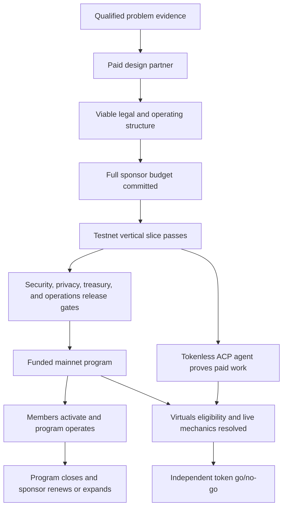

# Robinhood and Virtuals Implementation Plan

## Purpose

This folder converts the strategy into an executable, cross-repository plan.
It is intentionally product-first: customer and legal evidence can stop or
reshape engineering, and a token launch cannot substitute for a funded program.

The target is one Robinhood Chain-native, sponsor-funded Genesis Protection
Program operated by the Nakama Operator, with Virtuals ACP used only for
bounded non-PHI work. `$NAKAMA` remains a conditional launch after the product
can run without it.

No item in this folder means the corresponding code, deployment, customer,
legal approval, platform permission, or token is live.

## Governing Documents

- [Executive thesis](../00-executive-thesis.md)
- [Arc PMF and market wedge](../02-arc-pmf-and-market-wedge.md)
- [Genesis product specification](../03-genesis-product-spec.md)
- [Technical architecture](../11-technical-architecture.md)
- [Trust, privacy, legal, and safety](../12-trust-privacy-legal-and-safety.md)
- [Adversarial review and kill criteria](../14-adversarial-review-and-kill-criteria.md)
- [Evidence register](../15-evidence-register-and-open-questions.md)

If implementation conflicts with those documents, record the conflict in the
[decision register](./08-decision-register.md) before changing behavior or
public copy.

## Plan Index

1. [Master roadmap](./00-master-roadmap.md)
2. [Protocol contracts](./01-protocol-contracts.md)
3. [Agent, data, and services](./02-agent-data-and-services.md)
4. [SDK, app, and web](./03-sdk-app-and-web.md)
5. [Virtuals token launch](./04-virtuals-token-launch.md)
6. [GTM, content, and partnerships](./05-gtm-content-and-partnerships.md)
7. [Security, legal, and release gates](./06-security-legal-and-release-gates.md)
8. [Ninety-day backlog](./07-90-day-backlog.md)
9. [Decision register](./08-decision-register.md)
10. [Current implementation status](./09-current-implementation-status.md)

## Execution Rules

1. **Run commercial and legal discovery in parallel with testnet engineering.**
   Do not wait for a complete platform to ask for money, and do not deploy
   funded mainnet code before a viable structure exists.
2. **One vertical slice outranks broad infrastructure.** Complete program
   creation, full funding, enrollment, request, private review, appeal,
   obligation, settlement, refund, and report before adding new benefit types.
3. **Use generated interfaces.** Protocol deployments generate canonical ABIs,
   addresses, types, actions, and events consumed downstream.
4. **Make uncertainty visible.** Every issue cites a decision, hypothesis, or
   evidence gap. Unknown platform behavior is a blocker, not a reasonable
   default.
5. **No PHI in development shortcuts.** Local, testnet, demos, logs, analytics,
   prompts, ACP, screenshots, and support use synthetic data.
6. **Every economic action has an invariant and reconciliation.** UI success is
   insufficient without onchain and ledger proof.
7. **Every agent action has a policy and human fallback.** A model prompt is not
   authorization.
8. **No token-dependent critical path.** The funded program remains usable if
   Virtuals, ACP, the launchpad, or `$NAKAMA` is absent.
9. **Prefer stop decisions to hidden scope changes.** A failed gate triggers the
   named alternative rather than a quiet change in terminology.
10. **Public copy follows released behavior.** Planned architecture remains
    labelled planned until the release evidence packet passes.

## Cross-Repository Ownership

| Area | Primary repository | Required outputs |
| --- | --- | --- |
| Contract suite and accounting | `nakama-protocol` | Specifications, Solidity, tests, deployment scripts, manifests, security evidence |
| Typed integration layer | `nakama-sdk` | Generated ABIs, actions, EIP-712, events, AA, finality, typed receipts |
| Product and operations | `nakama-health` | Sponsor API/console, member app, private evidence, claims workflow, indexer, agent runtime, ACP adapter |
| Public narrative and transparency | `nakamahealth-website` | Buyer pages, product explanation, public program state, trust/risk/token disclosures |

Work is merged in dependency order. A downstream repository can prototype with
a versioned mock schema, but release requires generated artifacts from the
canonical protocol manifest.

## Work Item Format

Every implementation issue should contain:

- **Outcome:** user, operator, or safety result
- **Evidence/decision:** governing hypothesis, decision ID, or legal/security
  requirement
- **Scope:** explicit code, product, content, or operational boundary
- **Out of scope:** the tempting adjacent work that must not enter
- **Dependencies:** issue IDs and external decisions
- **Acceptance:** observable behavior and failure behavior
- **Tests/evidence:** commands, scenarios, screenshots, signed artifacts, or
  readbacks required
- **Owner and reviewer:** one accountable owner and named review function
- **Release effect:** no release, testnet, shadow mainnet, funded pilot, or
  token launch
- **Rollback/stop:** how to disable or revert without harming active programs

An issue is not complete because code exists. It is complete when its
acceptance behavior, adverse paths, evidence, downstream generation, and
documentation are reviewed.

## Gate Model

The product path and token path meet at a decision; the token path never gates
member support.

## Definition of the Ninety-Day Outcome

At day 90, success is one of two honest outcomes:

- a funded mainnet program has passed all gates, enrolled real members, and is
  operating under measurable service and safety controls; or
- evidence has produced a written no-launch, narrowing, or pivot decision
  before member money or trust was put at risk.

A testnet demo and token launch without a paid sponsor do not satisfy the plan.
